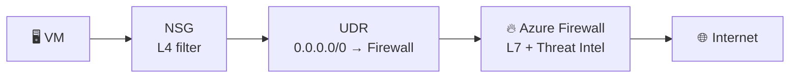
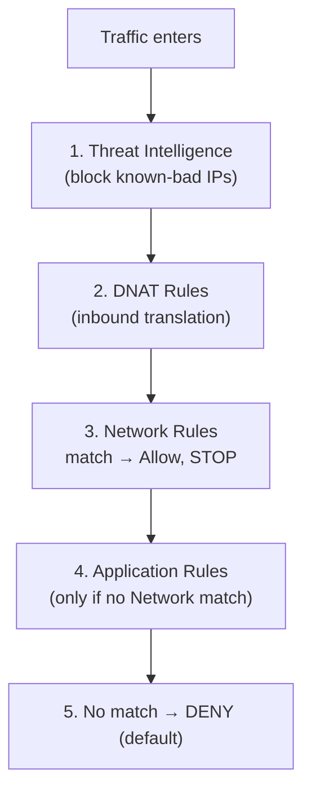

# Azure Firewall — Concepts & Rule Model

> A concept reference: why Azure Firewall exists alongside NSG and UDR, its three rule types, how rules are processed, and its deployment requirements. Theory notes — no billable resources deployed.

**Author:** Mosab Hassan · **Domain:** Azure Networking / Security

---

## 1. Why Azure Firewall — when we already have NSG and UDR

NSG, UDR, and Azure Firewall are **not alternatives — they are layers that work together.** Each answers a different question:

| Layer | Question it answers | OSI layer |
|-------|---------------------|-----------|
| **UDR** | *Where* does the traffic go? (routing) | L3 |
| **NSG** | Is this IP / port **allowed**? | L3–L4 |
| **Azure Firewall** | Is this traffic **safe and allowed by content**? | L3–**L7** |

### The gap only Firewall fills

| Capability | NSG | Azure Firewall |
|-----------|:---:|:--------------:|
| Filter by IP / Port | ✅ | ✅ |
| Filter by **FQDN** (e.g. `*.ubuntu.com`) | ❌ | ✅ |
| **Threat Intelligence** (block known-malicious IPs) | ❌ | ✅ |
| **Centralized logging** of all allow/deny | ❌ limited | ✅ |
| **Central** control point across VNets | ❌ (distributed) | ✅ |
| DNAT (publish an internal service) | ❌ | ✅ |

**The decisive example:** allow a VM to reach `*.ubuntu.com` only (for updates) and block the rest of the internet. **An NSG cannot** — it understands IP addresses, not domain names, and those IPs change constantly. **Azure Firewall can**, via Application Rules.

### How they work together



> **Key insight:** the **UDR does not filter** — it *forces* traffic through the Firewall instead of going straight to the internet. The **Firewall** then decides allow/deny intelligently. This is the same UDR mechanism from Lab 01 — except `Next hop` is now the **Firewall**, not `None`.

---

## 2. The three rule types

| Type | Layer | Filters by | Typical direction |
|------|-------|-----------|-------------------|
| **NAT Rules** (DNAT) | L3–L4 | IP + Port → translate inward | Inbound |
| **Network Rules** | L3–L4 | IP · Port · Protocol · Service Tag | Outbound |
| **Application Rules** | **L7** | **FQDN** · HTTP/HTTPS | Outbound |

**NAT (DNAT)** — publish an internal service without giving it a public IP:
```
Firewall_Public_IP : 2222   →   10.10.1.4 : 22   (internal SSH)
```

**Network Rule** — allow non-web traffic (DNS, NTP, databases):
```
Source: 10.10.1.0/24   Dest: *   Port: 53   Protocol: UDP   → Allow  (DNS)
```

**Application Rule** — the real differentiator; filter by domain name (NSG cannot):
```
Source: 10.10.1.0/24   Protocol: HTTPS   Target FQDN: *.ubuntu.com   → Allow
```

| Goal | Rule type |
|------|-----------|
| Publish an internal service to the internet | **NAT Rule** |
| Allow a specific IP/Port (DNS, DB) | **Network Rule** |
| Allow/deny sites by domain name | **Application Rule** |

---

## 3. Rule processing order

Rules are evaluated in a **fixed, strict order** — understanding it is the difference between a working firewall and one full of holes.



### ⚠️ The most dangerous trap

> **Network Rules are evaluated before Application Rules. If a Network Rule matches, Application Rules are skipped entirely.**

**Failure scenario:**
- Application Rule: allow `*.ubuntu.com` only (you want to restrict web).
- But also a broad Network Rule: allow `TCP 443` to `*`.

**Result:** the Network Rule matches first and allows all HTTPS → **FQDN filtering never runs**, and the VM reaches any site.

**Golden rule:** never open broad Network Rules on the ports you intend to control with Application Rules.

---

## 4. Deployment requirement — `AzureFirewallSubnet`

Azure Firewall is not deployed into any subnet — it requires a dedicated one with strict conditions:

| Requirement | Value | Mandatory? |
|-------------|-------|:----------:|
| Subnet name | `AzureFirewallSubnet` (exact spelling) | ✅ |
| Minimum size | `/26` (e.g. `10.10.3.0/26`) | ✅ |
| NSG on this subnet | **Not allowed** — Azure manages it | ✅ |
| Management subnet | `AzureFirewallManagementSubnet` (`/26`) | 🟡 optional (forced tunneling) |

**Why `/26`?** The firewall auto-scales and needs spare internal IPs.

**Link to the lab:** the firewall takes a **private IP** from this subnet (e.g. `10.10.3.4`) — exactly the IP a UDR points to as `Next hop = Virtual appliance`:
```
UDR:  0.0.0.0/0  →  Virtual appliance  →  10.10.3.4  (Firewall private IP)
```

---

## 💰 Cost note

Unlike NSG (free), Azure Firewall bills **~$1.25/hour (~$900/month)** plus data processing. For lab work: **deploy, test, delete the same day.**

---

## 🧠 Key takeaways

1. NSG · UDR · Firewall are **layers**, not alternatives.
2. Only the Firewall filters by **FQDN** (L7) — NSG cannot.
3. UDR **forces** traffic to the Firewall; it does not filter.
4. Processing order: **Threat Intel → DNAT → Network → Application → deny**.
5. A broad **Network Rule silently bypasses** Application (FQDN) rules.
6. Firewall needs a dedicated **`AzureFirewallSubnet` (/26)** with no NSG.

---

*Azure Networking Portfolio — Concept notes · Mosab Hassan*
