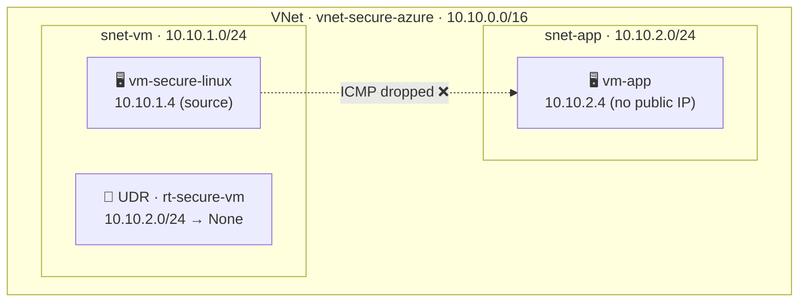

# Azure Lab 01 — Blocking Traffic with a User Defined Route (Blackhole)

> Isolating one Azure subnet from another using a UDR with `Next hop = None`, and proving cause-and-effect by measuring connectivity **before, during, and after** the route is applied.

**Engineer:** Mosab Hassan · **Platform:** Microsoft Azure · **Region:** East US · **Method:** Azure Portal

---

## 🎯 Objective

Two virtual machines sit in the **same virtual network** but **different subnets**. By default, Azure lets them communicate over a built-in *system route*. The goal of this lab is to **deliberately break that path** with a User Defined Route (UDR) that sends all traffic destined for the application subnet to `None` — a blackhole — and to **verify the block empirically** rather than assume it worked.

---

## 🗺️ Architecture



---

## 🧱 Environment

| Resource | Address / detail | NSG | Route table |
|---|---|---|---|
| VNet **vnet-secure-azure** | `10.10.0.0/16` | — | — |
| Subnet **snet-vm** | `10.10.1.0/24` | `nsg-vm-secure` | `rt-secure-vm` |
| Subnet **snet-app** | `10.10.2.0/24` | none | none |
| VM **vm-secure-linux** | `10.10.1.4` · public IP | via subnet | via subnet |
| VM **vm-app** | `10.10.2.4` · private only | via subnet | via subnet |
| Route **Block-Test-Subnet** | dest `10.10.2.0/24` | — | next hop: **None** |

> **Design choice:** `vm-app` has **no public IP** — an internal server should not be exposed to the internet. Reachability is tested over the private VNet only.

---

## 🧪 Steps Performed

1. **Reset** — dissociated any route table from `snet-vm`; confirmed **Effective routes** showed only system routes (`Source = Default`).
2. **Create** `snet-app` (`10.10.2.0/24`) inside the existing VNet.
3. **Deploy** `vm-app` into `snet-app` with **no public IP**.
4. **Baseline** — `ping` from `vm-secure-linux` to `vm-app` → success.
5. **Apply UDR** — route `10.10.2.0/24 → None`, associate `rt-secure-vm` with `snet-vm`; confirmed `Source = User` in Effective routes.
6. **Re-test** — same `ping` → blocked.
7. **Rollback** — dissociate the route table; `ping` succeeds again, proving causation.

---

## 📊 Evidence — Connectivity Test

The **same command** — `ping -c 4 10.10.2.4` from `vm-secure-linux` — run at three points. Only the route changed between them.

**1 · Baseline (no UDR) — ✅ 0% loss**
```console
$ ping -c 4 10.10.2.4
64 bytes from 10.10.2.4: icmp_seq=1 ttl=64 time=1.25 ms
64 bytes from 10.10.2.4: icmp_seq=2 ttl=64 time=7.03 ms
64 bytes from 10.10.2.4: icmp_seq=3 ttl=64 time=1.58 ms
64 bytes from 10.10.2.4: icmp_seq=4 ttl=64 time=7.18 ms
--- 10.10.2.4 ping statistics ---
4 packets transmitted, 4 received, 0% packet loss
```

**2 · UDR applied — ❌ 100% loss**
```console
$ ping -c 4 10.10.2.4
PING 10.10.2.4 (10.10.2.4) 56(84) bytes of data.
--- 10.10.2.4 ping statistics ---
4 packets transmitted, 0 received, 100% packet loss
```

**3 · Rollback (UDR removed) — ✅ 0% loss**
```console
$ ping -c 4 10.10.2.4
64 bytes from 10.10.2.4: icmp_seq=1 ttl=64 time=18.3 ms
64 bytes from 10.10.2.4: icmp_seq=2 ttl=64 time=2.14 ms
64 bytes from 10.10.2.4: icmp_seq=3 ttl=64 time=3.73 ms
64 bytes from 10.10.2.4: icmp_seq=4 ttl=64 time=11.3 ms
--- 10.10.2.4 ping statistics ---
4 packets transmitted, 4 received, 0% packet loss
```

> The block appears **only** while the route table is associated and disappears the moment it is removed. The UDR is the **sole cause** — no other variable changed.

---

## 🧠 Why It Works — Longest Prefix Match

Azure routing **ignores rule order and priority**. For any destination it selects the route with the **most specific (longest) prefix**. Traffic to `10.10.2.4` matches both routes — the `/24` wins because it is narrower than the `/16`.

| Route | Prefix | Next hop | Result |
|---|---|---|---|
| System | `10.10.0.0/16` | Virtual network | ❌ lost the match |
| **User (UDR)** | `10.10.2.0/24` | **None** | ✅ **wins → drops packets** |

Because the winning route's next hop is `None`, matching packets are silently discarded. Verified in **Effective routes**, where the entry showed `Source = User` — proof the custom route, not a system default, was in force.

---

## 📚 Concepts Demonstrated

| Concept | What it means here |
|---|---|
| **System routes** | Azure auto-creates `10.10.0.0/16 → Virtual network` so subnets talk with zero config. |
| **User Defined Route (UDR)** | A custom route that **overrides** the system default for a given prefix. |
| **Next hop = None** | A **blackhole** — matching traffic is dropped. A precise isolation tool. |
| **Association direction** | The route table attaches to the **source** subnet — routing applies where traffic *leaves*. |
| **Effective routes** | The NIC-level view of the *actual* route in force; `Source = User` vs `Default`. |
| **Verification by rollback** | Change one variable, re-test → proves **causation**, not correlation. |

---

## 🛠️ Skills

`Azure Virtual Network design` · `Subnet segmentation` · `Route tables & UDR` · `Blackhole routing` · `Effective routes analysis` · `Longest Prefix Match` · `Linux (SSH · ICMP testing)` · `Hypothesis-driven verification`

---

*Azure Networking Portfolio — Lab 01: Routing Control · Mosab Hassan*
